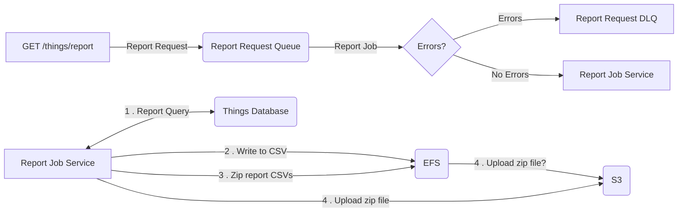

```mermaid
flowchart LR
    A[GET /things/report] -->|Report Request| B(Report Request Queue)
    B -->|Report Job| C{Errors?}
    C -->|Errors| D[Report Request DLQ]
    C -->|No Errors| E[Report Job Service]
    F[Report Job Service] <-->|1 . Report Query| G(Things Database)
    F --->|2 . Write to CSV| J(EFS)
    F -->|3 . Zip report CSVs| J(EFS)
    J -->|4 . Upload zip file?| K(S3)
    F -->|4 . Upload zip file| K(S3)
```