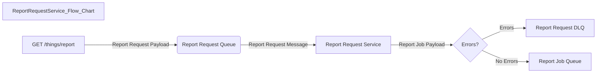

```mermaid
flowchart LR
    ReportRequestService_Flow_Chart
    A[GET /things/report] -->|Report Request Payload| B(Report Request Queue)
    B -->|Report Request Message| C[Report Request Service]
    C -->|Report Job Payload| D{Errors?}
    D -->|Errors| E[Report Request DLQ]
    D -->|No Errors| F[Report Job Queue]
```