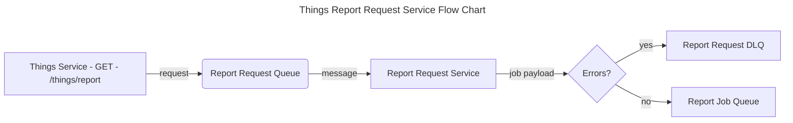

```mermaid
---
title: Things Report Request Service Flow Chart
---

flowchart LR
    
    ThingsService[Things Service - GET - /things/report] -->|request| ReportRequestQueue(Report Request Queue)
    ReportRequestQueue -->|message| ReportRequestService[Report Request Service]
    ReportRequestService -->|job payload| Errors{Errors?}
    Errors -->|yes| ReportRequestDLQ[Report Request DLQ]
    Errors -->|no| ReportJobQueue[Report Job Queue]
```
